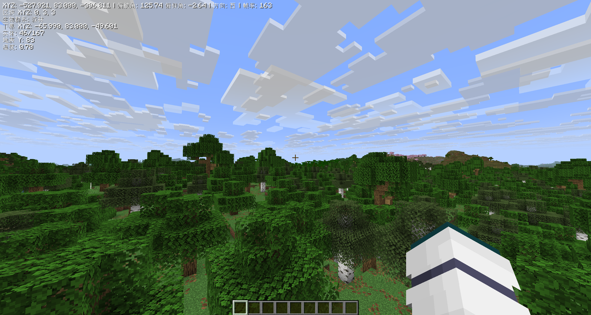

# 坐标 HUD 模组

  

一个 Minecraft 的客户端 Fabric 模组，显示一个全面的抬头显示器(HUD)，提供有关玩家及其环境的各种信息。



## 功能

HUD 实时显示以下信息：

- **玩家坐标 (XYZ)**：玩家在世界中的精确位置。
- **区块相对坐标**：玩家在当前区块中的位置（每个轴为 0-15）。
- **生物群系**：玩家所在生物群系的名称。
- **方向和角度**：
  - 基本方向（东、南、西、北）。
  - 偏航角（水平旋转）。
  - 俯仰角（垂直旋转）。
- **帧率 (FPS)**：当前游戏帧率，用于性能监控。
- **跨维度坐标**：
  - 自动计算并显示下界（如果在主世界）或主世界（如果在下界）中的对应坐标。
  - 其他维度显示 "N/A"。
- **实体计数**：
  - 玩家视野内当前的活体实体数量。
  - 世界中活体实体的总数。
- **地表高度**：玩家 XZ 位置处世界顶部方块的 Y 坐标。
- **温度**：当前生物群系的温度。

## 控制

- **切换 HUD 显示**：按下 `F10` 键显示或隐藏 HUD。

## 语言支持

该模组支持多种语言：

- English (en_us)
- 简体中文 (zh_cn)

该模组的名称和描述也针对 [Mod Menu](https://github.com/TerraformersMC/ModMenu) 进行了本地化。

## 要求

- **Minecraft**：1.21.8
- **Fabric Loader**：0.15.11 或更高版本
- **Fabric API**：0.133.0+1.21.8 或更高版本

## 安装

1. 为 Minecraft 1.21.8 下载并安装 [Fabric Loader](https://fabricmc.net/use/)。
2. 下载 [Fabric API](https://www.curseforge.com/minecraft/mc-mods/fabric-api) 模组 jar 文件。
3. 从 [Releases](https://github.com/CPT-KK/mc-coordinate-hud/releases) 页面下载最新的 `coordinate-hud-<version>.jar` 文件。
4. 将下载的 `fabric-api-<version>.jar` 和 `coordinate-hud-<version>.jar` 文件放入你的 `.minecraft/mods` 文件夹。
5. 使用 Fabric 配置文件启动 Minecraft。

## 从源码构建

该项目使用带有 Fabric Loom 插件的 Gradle。

### 先决条件

- Java 开发工具包 (JDK) 21 或更高版本。

### 步骤

1. 克隆仓库：
   ```bash
   git clone https://github.com/CPT-KK/mc-coordinate-hud.git
   cd mc-coordinate-hud
   ```
2. 设置开发环境：
   ```bash
   ./gradlew genSources
   ```
3. 构建模组：
   ```bash
   ./gradlew build
   ```
   构建的 jar 文件将位于 `build/libs/` 目录中。

4. 运行开发客户端：
   ```bash
   ./gradlew runClient
   ```

## 许可证

该模组基于 MIT 许可证授权。详见 [LICENSE](LICENSE) 文件。

## 致谢

- [Fabric](https://fabricmc.net/)
- [Fabric API](https://github.com/FabricMC/fabric)